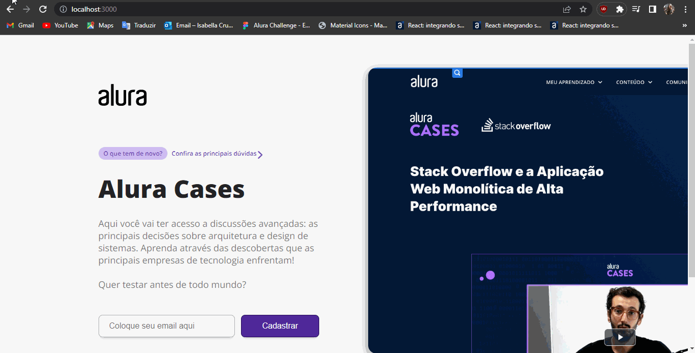

## 💻 Sobre o projeto

A Cases Alura, é uma aplicação desenvolvida com Next.js e Javascript. 

Voce pode iniciar o projeto com
                    $ yarn next build && yarn start 

---

## 🛠 Tecnologias

As seguintes tecnologias foram utilizadas no desenvolvimento da API Rest do projeto:

- **[Javascript](https://www.oracle.com/javascript)**
- **[Next.js](https://www.oracle.com/nextjs)**

---

## 📝 TELAS  

# INICIO  

# FAQ 

---
